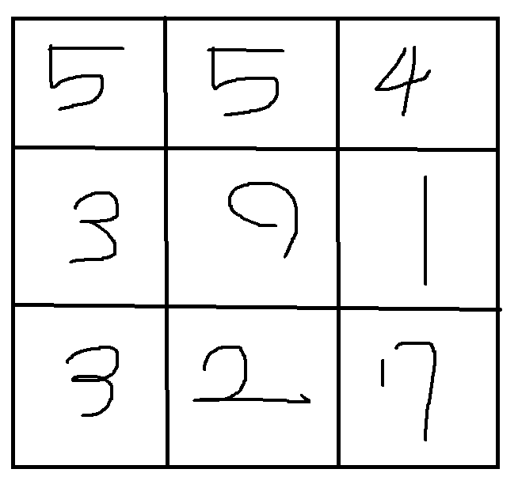

# 0316 스터디

[4485번: 녹색 옷 입은 애가 젤다지?](https://www.acmicpc.net/problem/4485)

문제 

루피는 젤다의 전설 화폐이고 도둑루피는 소지한 루피가 감소하게 된다.

동굴안에는 도둑루피만 이 가득하다. 하지만 젤다는 이 동굴을 통과해야한다.

동굴을 통과할 때 상화좌우 인접한곳으로 1칸씩 이동할 수 있다.

링크가 동굴을 잃을 수 밖에 없는 최소 금액은 얼마일까??

동굴(맵)의 크기 N x N index(0,0 ~ (n-1,n-1) 

링크가 한번에 갈수 있는범위 : 상하좌우 한칸

목표 :  n-1,n-1 지점까지 갔을 때 잃은 금액을 가장 최소로 만들어라

동굴 예제

만들 변수

(객체) Vertex ⇒ 좌표와 최솟값을 저장할 객체를 생성

int r, int c, int minDistance

N ⇒ 동굴 가로, 세로의 길이

cave ⇒ 동굴의 정보를 저장할 이차원배열

dr ,dc ⇒ 사방탐색을 위한 배열

distance[][] ⇒ 위치까지 최소값을 저장할 변수 (이차원배열 cave와 같은 모습)

visited[][] ⇒ 최소비용이 확정된다면 저장할 변수

pQueue ⇒ (우선순위큐) 가장 작은 값을 먼저 계산하기 위한 큐

사용할 알고리즘 : 다익스트라 알고리즘 

step01.

- 0,0 부터 시작
    - 처음 시작점의 가장 최소 이동 값은 자기자신의 값이므로
    - distance[0][0] = cave[0][0] (최소거리 넣는 배열에 자기자신의 값을 넣는다.)
    - 그리고 pQueue에도 이 값을 객체화하여 저장 (0,0, distance[0][0])

step02.

- 한칸씩 이동한다.
    - 사방 탐색을 통하여 한 칸씩 이동한다.
    - 이동할때 pQueue에서 값을 꺼내여 현재 거리중 최솟값을 가진 거리를 먼저 방문한다.

step03.

- 사방 탐색을 한 값을 pQueue에 넣는다.(pQueue는 자동으로 오름차순으로 정렬되므로 가장 앞에 있는 값이 최솟값이다.)
    - step02와 step03을 반복하여 원하는 위치까지 최소값을 저장한다.

결과

distance[N-1][N-1]의 값을 출력한다.
