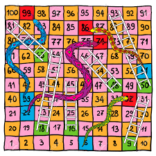

# 뱀과 사다리 게임

### 문제 해석

1. 출발은 1의 자리에서 출발한다. 주사위를 굴려서 나온만큼 전진한다.
2. 전진하다 사다리를 만난다면 위로 올라가고 뱀을 만난다면 밑으로 내려간다.
3. 주사위를 던진 개수를 최소한으로 하여 100까지 도달하도록 만들어야 한다.

### 문제풀이

Step01 주사위를 던진다.

- 1~6칸을 모두 전진한다. (각자 전진한다.)

Step02 각자 전진된 위치에 뱀이 있는지 사다리가 있는 지 확인한다.

- 뱀이라면 내려가고 사다리라면 올라간다.
- 전진할 때마다 전진한 횟수에 +1을 한다.

Step03 step01과 step02를  반복한다.

- 반복하다 100의 위치에 도착하면 종료하고 던진횟수를 반환한다.

### ✴️ 주의사항 ✴️

- 뱀을 마주치더라도 던진횟수가 최소일 수도 있다.